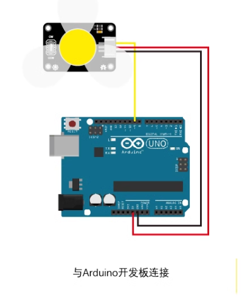

## Arduino的接线

## 传感器和简单执行器

2 - DHT11 DATA

18 TX1-RX1 ESP8266

19 RX1-TX1 ESP8266

20 SDA-SDA LED

21 SCL-SCL LED

4 加湿器的控制线。（见加湿器电路设计）

5 除湿风扇的控制线。

6 降温风扇的控制线

7 电热片的控制线

22 衣架新衣服的开关通知（如果放进新衣服了，打开一下开关通知它。本来想做称重检测，太麻烦就改用开关了）

// 舵机控制引脚
static const int SERVO_PIN = 13;

24 步进电机IN1

25 步进电机IN2

26 步进电机IN3

27 步进电机IN4

// 光敏电阻连接的模拟输入引脚
static const int lightSensorPin = A0;

// 可变电阻连接的模拟输入引脚
static const int potentiometerPin = A1;

// LED连接的数字输出引脚
static const int lightPin = DAC0;

// 设置步进电机引脚，总步数，每步的步长（以微秒为单位）
Unistep2 stepper(23, 25, 27, 29, 4096, 4096);

23/25/27/29 步进电机 IN 1 2 3 4

LED灯 正极DAC0 负极GND 串联55欧姆电阻

### OV7670引脚图

|       | 1       | 2          | 3            | 4        | 5    | 6    | 7    | 8    | 9     | 10     | 11     |
|-------|---------|------------|--------------|----------|------|------|------|------|-------|--------|--------|
| **1** | WRST  √ | WR(WEN)  √ | STR x        | RST    √ | D1 √ | D3 √ | D5 √ | D7 √ | VSY √ | SIOC √ | 3.3V √ |
| **2** | RRST √  | OE √       | RCK(RCLK)  √ | PWDN √   | D0 √ | D2 √ | D4 √ | D6 √ | HREF  | SIOD √ | GND √  |

OV7670引脚 - Arduino Due引脚 描述 外上内里

基础接线

3v3 3v3

gnd gnd

reset 51

pwdn gnd

SIOD SDA + 1k pullup 黑线

SIOC SCL + 1k pullup 白线

OE 50

VSYNC 3 垂直同步信号（谨慎移动，因为这个使用了中断）

HREF 8 （没有接线，没有用到）

WRST 49 写复位

RRST 48 读复位

WEN 47 写使能

RCLK 46 读时钟

D0 44 数据线0 下

D1 45 数据线1

D2 42 数据线2 下

D3 43 数据线3

D4 40 数据线4 下

D5 41 数据线5 上

D6 38 数据线6 下

D7 39 数据线7 上


### 加湿器和加温器电路设计
1. **确定基极电阻**：
   - 首先，需要计算基极电阻 $ R_B $。晶体管的基极电流 $ I_B $ 应足以确保集电极电流 $ I_C $ 的需求。一般情况下，我们考虑 $ I_C = 10 \times I_B $（即 β（直流电流增益）至少为 10）。
   - 假设您的负载电流需求为 $ I_C = 500 \, \text{mA} $，则 $ I_B $ 至少需要为 $ \frac{I_C}{10} = 50 \, \text{mA} $。
   - 基极电阻 $ R_B $ 可以通过以下公式计算：
     $$
     R_B = \frac{V_{\text{Arduino}} - V_{BE}}{I_B}
     $$
   - $ V_{\text{Arduino}} = 3.3 \, \text{V} $，$ V_{BE} $ 一般取 0.7V。因此：
     $$
     R_B = \frac{3.3 \, \text{V} - 0.7 \, \text{V}}{50 \, \text{mA}} = 52 \, \Omega
     $$
   - 选择标准电阻值，例如 56 Ω 或 47 Ω。

2. **连接电路**：
   - 将 Arduino Due 的 3.3V 引脚通过基极电阻连接到 S8050 的基极。
   - 将 S8050 的集电极连接到 5V 的加湿器或者加温器。
   - 将加湿器的另一端接集电极。
   - 将 S8050 的发射极接地。

3. **测试电路**：
   - 确保所有连接正确无误后，上电测试电路，检查是否能够正常控制 5V 输出。

下面是电路示意图的简化表达：

```
3.3V (Arduino) ──[56Ω]──┐
                        ├─> [基极] S8050 [发射极] ── 地
5V ──[加湿器or加温器]──┐  │
             └─> [集电极]│
```

### 风扇

